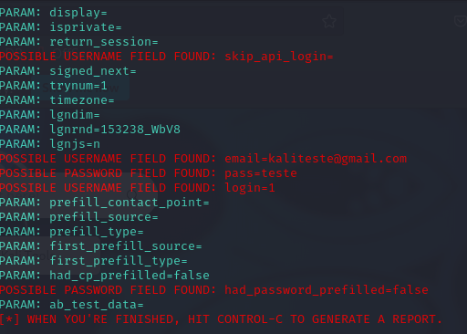

# Phishing para captura de login e senha do Facebook

 Ferramenta utilizada :

- Kali Linux
- setoolkit

 Configuração do Phishing no Kali Linux :

- Acesso root: ``` sudo su ```
- Iniciando o setoolkit: ``` setoolkit ```
- Tipo de ataque: ``` Social-Engineering Attacks ```
- Vetor de ataque: ``` Web Site Attack Vectors ```
- Método de ataque: ```Credential Harvester Attack Method ```
- Método de ataque: ``` Site Cloner ```
- Obtendo o endereço da máquina: ``` ifconfig ```
- URL para clonagem: http://www.facebook.com

### Resutados :


